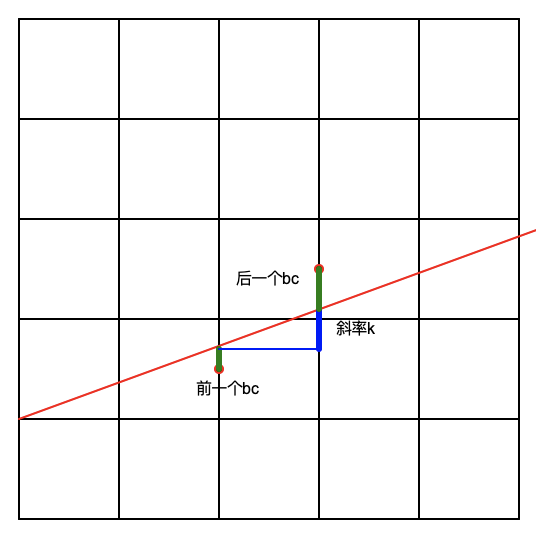
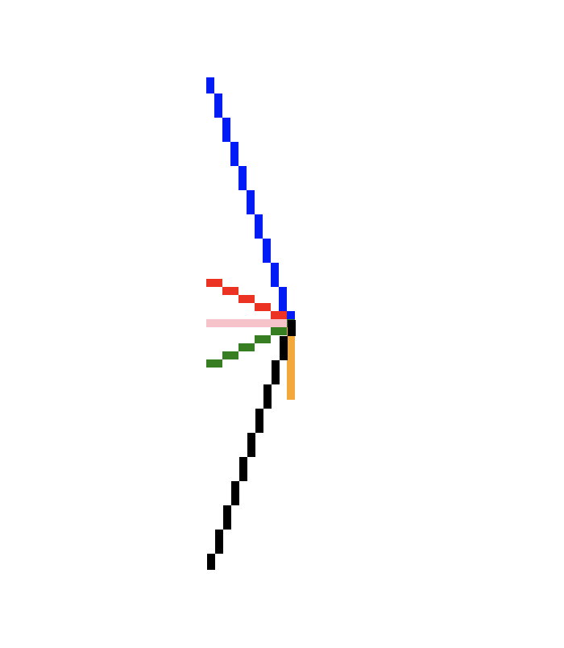

## 计算机图形学：Bresenham画线算法

为了将直线光栅化显示，需要找到最接近直线的像素点。Bresenham算法的基本思路就是在已知前一点的坐标的情况下，如何确定下一点的像素坐标。

为了简便，我们先考虑斜率为[0, 1]的情况。类似中点画线法，我们只要确认两个待选点的中点在直线哪边就可以确定选哪个点了。

假定已经确定的点的坐标为(x_i, y_ir),那么待确定的点的坐标就是(x_i + 1, y_ir)和(x_i + 1, y_ir + 1)，它们的中点是(x_i + 1, y_ir + 0.5).

而实际的在直线上的点为(x_i + 1, y_(i+1)),那么差值就是bc_(i+1) = y_(i+1) - y_(i,r) - 0.5

如果这个值大于等于0，我们取上面的点(x_i + 1, y_ir + 1)，否则我们取下面的点(x_i + 1, y_ir)

为了方便使用增量算法计算，我们可以用bc_(i+1)用bc_i来表示。

- 当前一项的bc_(i+1)大于等于0时，由于取了上面，因此y_(i+1,r) = y_(i,r) + 1，由此可以得到
bc_(i+2) = y_(i+2) - y_(i+1,r) - 0.5 = y_(i+2) - y_(i,r) - 1 - 0.5 = y_(i+1) + k - y_(i,r) - 1 - 0.5 = bc_(i+1) + k - 1
即

**bc_(i+2) = bc_(i+1) + k - 1 (bc_(i+1) >= 0)**

- 当前一项的bc_(i+1)小于0时，y_(i+1,r) = y_(i,r)，因此

**bc_(i+2) = bc_(i+1) + k (bc_(i+1) < 0)**

当然，我认为通过几何意义更容易理解，这是我利用turtle绘制的理解图



显然，bc = bc + k - 1，同理可以想象，当前一个bc为负数时（图示的下一次迭代），bc = bc + k。

个人编写的Bresenham算法如下所示：
```Python
# 利用Bresenham直线算法和turtle绘制光栅化直线
# 导入海龟绘图
import turtle as t

# 设置每个像素格的边长大小
axis = 5


# 绘制某个方格
def drawPixel(x, y, color):
    t.penup()
    t.color(color)
    t.setheading(0)
    t.goto(x * axis, y * axis)
    t.begin_fill()
    for _ in range(4):
        t.forward(axis)
        t.left(90)
    t.end_fill()
    t.pendown()


def line(x0, y0, x1, y1, color):
    if x1 < x0:
        temp = x0
        x0 = x1
        x1 = temp
        temp = y0
        y0 = y1
        y1 = temp
    dx = x1 - x0
    dy = y1 - y0
    if dx == 0:
        if dy > 0:
            for i in range(1, dy):
                drawPixel(x0, y0 + i, color)
        else:
            for i in range(1, -dy):
                drawPixel(x0, y1 + i, color)
    else:
        k = dy / dx
        xnew = x0
        ynew = y0
        if 0 <= k <= 1:
            ba = k - 0.5
            while xnew != x1:
                if ba <= 0:
                    ba += k
                else:
                    ba += k - 1
                    ynew += 1
                xnew += 1
                drawPixel(xnew, ynew, color)
        elif k > 1:
            ba = 1 / k - 0.5
            while ynew != y1:
                if ba <= 0:
                    ba += 1 / k
                else:
                    ba += 1 / k - 1
                    xnew += 1
                ynew += 1
                drawPixel(xnew, ynew, color)
        elif 0 > k >= -1:
            ba = -k - 0.5
            while xnew != x1:
                if ba <= 0:
                    ba += -k
                else:
                    ba += -k - 1
                    ynew -= 1
                xnew += 1
                drawPixel(xnew, ynew, color)
        elif k < -1:
            ba = -1 / k - 0.5
            while ynew != y1:
                if ba <= 0:
                    ba += -1 / k
                else:
                    ba += -1 / k - 1
                    xnew += 1
                ynew -= 1
                drawPixel(xnew, ynew, color)
    drawPixel(x0, y0, color)


t.speed(0)
line(-10, -10, -10, -20, 'orange')
line(-10, -10, -20, -10, 'pink')
line(-10, -10, -20, -5, 'red')
line(-10, -10, -20, 20, 'blue')
line(-10, -10, -20, -15, 'green')
line(-10, -10, -20, -40, 'black')
t.hideturtle()
t.exitonclick()
```

示例的结果为：


