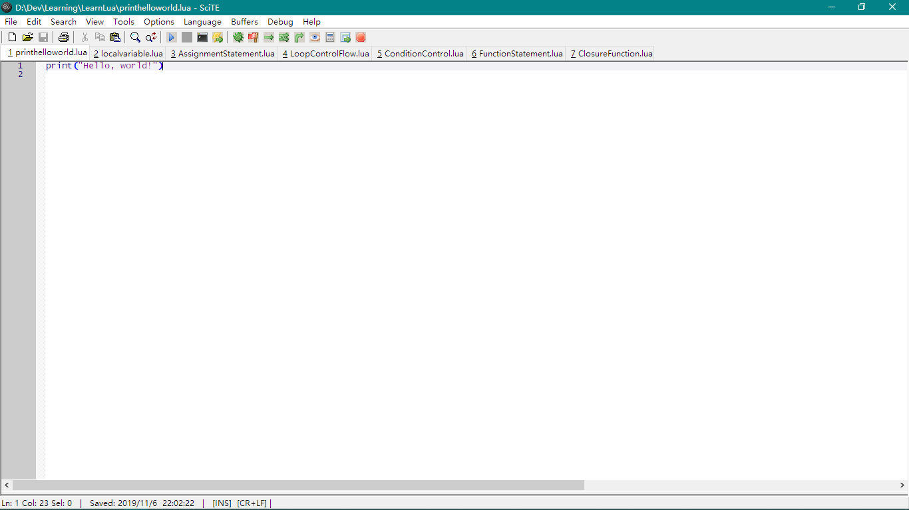

## Lua语言学习1：基本语法和数据类型

这两天在学习C++的闲余时刻，学了学Lua，感觉和Matlab、Python比较像。记录一下学习过程，方便日后参考和复习。

### 0.Lua的安装和运行

因为我用的是 Windows 平台，直接下载了Luaforwindows软件，在SciTE里进行程序的运行和调试。




当然也可以在控制台内运行命令 lua 直接在控制台内操作，如下操作。

```
Windows PowerShell
版权所有 (C) Microsoft Corporation。保留所有权利。

PS C:\Users\mxy> lua
Lua 5.1.4  Copyright (C) 1994-2008 Lua.org, PUC-Rio
>
  
```
### 1.Lua的数据类型

Lua拥有八种数据类型，分别是：nil、boolean、number、string、userdata、function、thread、 table。可用type()函数获取变量的数据类型

>- nil 
> 表示空的数据类型，未定义的变量就是nil
>>
>- boolean
> 只有true或者false
>>
>- number
> 所有的数值都是number，没有整数、浮点数之分
>>
>- string
> 字符串类型
>>
>- userdata
> 存储在变量中的C数据结构
>>
>- function
> Lua编写的函数
>>
>- thread
> 线程，用于执行协同程序
>>
>- table
> 关联数组，有key和value，key缺省情况下从1递增

### 2.基本语法 —— 赋值

Lua语言为动态数据类型，赋值与其它动态数据类型类似

``` Lua
-- string 赋值 --
a = "hello" .. 'lua'

-- 多个数据赋值 --
a, b = 10, 2.31
a, b, c = 1, 2	 --> ignore c
a, b, c = 4, 3, 2, 1  --> ignore 1

-- tabel 赋值 --
tabl = {}
tabl['id1'] = 'hello'
tabl['id2'] = '(*^▽^*)'
```
### 3.基本语法 -- 循环
Lua中循环语句也主要有for、while、repeat等，do ... end类似一个块放在里面的语句类似其它语言的放在花括号内。

```Lua
-- while ... do ... end --
i = 0
while i < 5 do
	print(i)
	i = i + 1
end

-- for ... do ... end -- 
for i = 0,5,1 do
	print(i)
end
t = {'one', 'two', 'three'}
for k,v in ipairs(t) do --> 泛型for
	print(k .. '--' .. v)
end

-- repeat do ... end until ... --
-- 类似其它语言的do..while语句 --
repeat
  do
	print(i)
	i = i + 1
  end
until(i == 5)
```
### 4.基本语法 —— 条件
类似其它语言的使用，不过多了一个then，就像循环多了一个do

```Lua
-- if(...) then ... elseif(...) then ... else ... end --
if(0) then
	print('0 is true')
else
	print('0 is false')
end
```
### 5.基本语法 —— 函数
函数定义需要function关键字，类似matlab也需要function
```Lua
-- function FName(...) ... end --
function max(num1,num2)
	if num1 > num2 then
		return num1
	else
		return num2
	end
end

print(max(2,3))
```
函数可以返回多个值，用多个值来接收。当然，也可以返回function，这叫做closure function。
```Lua
-- closure function --
function iter()
	print('in iter function')
	local i = 0 --> 定义为局部变量
	j = 0 --> 默认为全局变量
	return function()
		i = i + 1
		j = j + 1
		print('in closure function :',j)
		print('in closure function :',i)
	end
end

f1 = iter()
f1()
f1()
f1()
```
输出为:

```Lua
in iter function
in closure function :	1
in closure function :	1
in closure function :	2
in closure function :	2
in closure function :	3
in closure function :	3
```

[返回主页](https://kimomi.github.io/)
